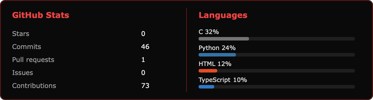

  

 

  
  &nbsp;
  
  &nbsp;
  

---

## About

I study at **42 Türkiye**. Day to day I write scrapers and small APIs in Python; at school I spent a lot of time in C / C++ (shell, IRC, Docker).

| | |
|:--|:--|
| **Now** | Web scraping, browser automation, seller-side tools |
| **School** | 42 common core — Unix, C++98, Docker |
| **Stack** | Python · C / C++ · TypeScript · Docker |
| **Speak** | English · Turkish |

---

## Stack

  

 

  
  
  
  
  

---

## Featured

<table>
  <tr>
    <td width="50%" valign="top">
      <h3>🛒 <a href="https://github.com/bedirrhaan/ecommerce-ai-seller-panel">ecommerce-ai-seller-panel</a></h3>
      
Seller panel I actually used — orders, stock, Q&amp;A and some Gemini helpers across TR marketplaces.

      <code>Python</code> · <code>FastAPI</code> · <code>Gemini</code>
    </td>
    <td width="50%" valign="top">
      <h3>🐳 <a href="https://github.com/bedirrhaan/dockerized-wordpress-stack">dockerized-wordpress-stack</a></h3>
      
42 Inception: Nginx (TLS) + WordPress/php-fpm + MariaDB, each in its own image.

      <code>Docker</code> · <code>Nginx</code> · <code>MariaDB</code>
    </td>
  </tr>
  <tr>
    <td width="50%" valign="top">
      <h3>📡 <a href="https://github.com/bedirrhaan/cpp-irc-server">cpp-irc-server</a></h3>
      
IRC server in C++98 — <code>poll()</code>, channels, MODE, PRIVMSG.

      <code>C++98</code> · <code>sockets</code>
    </td>
    <td width="50%" valign="top">
      <h3>🐚 <a href="https://github.com/bedirrhaan/custom-unix-shell">custom-unix-shell</a></h3>
      
42 minishell — pipes, redirections, builtins, signals.

      <code>C</code> · <code>Unix</code>
    </td>
  </tr>
  <tr>
    <td width="50%" valign="top">
      <h3>🎮 <a href="https://github.com/bedirrhaan/realtime-pong-platform">realtime-pong-platform</a></h3>
      
42 transcendence: Pong + chat, Next.js and Docker.

      <code>Next.js</code> · <code>Docker</code>
    </td>
    <td width="50%" valign="top">
      <h3>🔥 <a href="https://github.com/bedirrhaan/turnstile-solver-api">turnstile-solver-api</a></h3>
      
Small API that solves Cloudflare Turnstile with a browser pool, for my scrapers.

      <code>Python</code> · <code>Quart</code>
    </td>
  </tr>
</table>

---

## Stats

  

---

  

